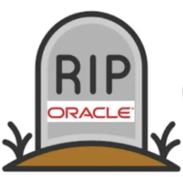

#### Warning Warning Warning!!!!
this themes is only for [v2board-dev1.6.1-49d9c45](https://github.com/v2board/v2board/tree/49d9c453d80439ac98ba6445062e0dc40719e52e)  

# **V2Board**

- PHP7.3+
- Composer
- MySQL5.5+
- Redis
- Laravel

## Demo
[Demo](https://v2board.com)

## Document
[Click](https://docs.v2board.com)

## OtherThemesForv2board Telegram group
[OtherThemes](https://t.me/OracleAI)

## Donation

## Sponsors
Thanks to the open source project license provided by [Jetbrains](https://www.jetbrains.com/)

## Community
Telegram Channel: [@v2board](https://t.me/v2board)  

## Rules
1.We have closed issue. If you want to find us, please contact us through the telegram group.  
2.Forward, Please indicate the original repo.  
3.This repo is v2board api interface open source.  
4.Due to the copyright problem, we have no plan to open source the front-end, but the front-end code is still readable.
